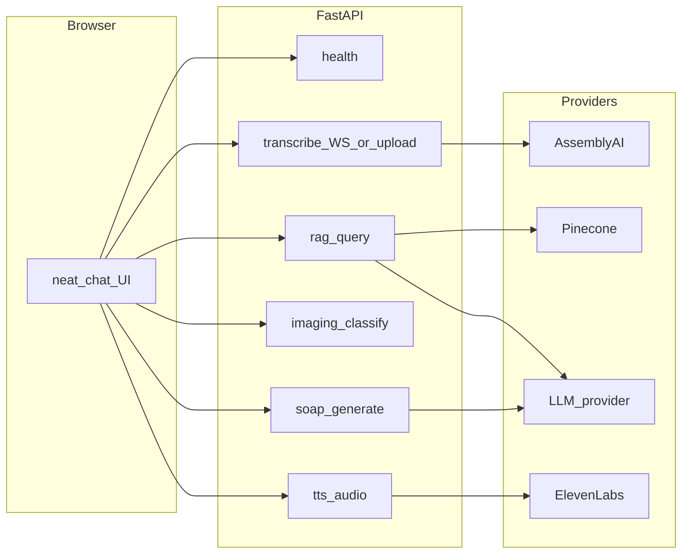

# Mark 1 — NoteWise AI Medical Voice Scribe (detailed)

## Product summary

End-to-end **demo**: capture or simulate doctor–patient audio, **stream or batch transcribe** (AssemblyAI primary; optional local Whisper), **retrieve** from a small **medical knowledge base** via **LangChain + Pinecone**, optionally **classify** an uploaded **chest X-ray** (MONAI + ViT or ViT-only fallback), **generate a structured SOAP note** (LLM + Pydantic), **read back** via **ElevenLabs TTS**. **Backend**: FastAPI. **UI**: [neat-chat-interface](https://github.com/DHIWAHAR-K/neat-chat-interface) (Vite/React) with **minimal wiring only**—no layout or theme redesign.

## Non-negotiables

- **Not for clinical use** in API responses and any user-visible copy you add without changing the stock UI layout.
- **No PHI** in logs, analytics, or committed files; no real patient audio in cloud without BAA and a proper design review.
- **GitHub**: only **application** and **config templates** (e.g. `.env.example`, `.gitignore`). **Never commit**: `CLAUDE.md`, **entire** `.claude/` tree (skills, `private/`, `settings.json`), `.env`, secrets.

## Environment and branch

| Item | Detail |
|------|--------|
| **Conda** | `conda create -n notewise python=3.12 -y` (adjust if a dep pins otherwise). Document exact commands in **`.claude/private/conda.md`**. |
| **Shell rule** | `conda activate notewise` before all backend installs, `uvicorn`, tests, and Docker builds that use local Python. |
| **Git branch** | `git checkout -b dev/testing` before first app commit; all Mark 1 commits on `dev/testing`. |

## `.gitignore` (first committed file set)

Minimum:

```gitignore
.env
.env.*
!.env.example
CLAUDE.md
.claude/
# optional: .local/
```

**Pre-commit guard**: `git diff --cached --name-only` must not match `^\.claude/` or `^CLAUDE\.md$`. Never `git add -f` for those paths.

## Private layout under `.claude/` (local only)

| Path | Contents |
|------|----------|
| `.claude/private/conda.md` | Conda create/activate, channel notes. |
| `.claude/private/setup.md` | How to run `backend` + `frontend` dev (ports, proxy). |
| `.claude/private/imaging.md` | GPU/CPU notes, weight download, model id. |
| `.claude/private/deploy-gcp.md` | `gcloud run deploy` flags, service name, region, Secret Manager key names. |

**No** repo folder named `mark_1`; slash command remains **`/mark-1`** with skill dirs `.claude/skills/mark-1/` and `.claude/skills/mark-1-phase-N/` (hyphenated names per [Claude Code skills](https://code.claude.com/docs/en/skills.md)).

## Claude Code bootstrap (generate locally, never push)

| Artifact | Role |
|----------|------|
| Root **`CLAUDE.md`** | Project rules, phase detection table (below), commit prefixes, conda/branch reminders. |
| **`.claude/skills/mark-1/SKILL.md`** | Orchestrator: infer next phase → run matching phase skill → verify → commit **tracked files only** → push → suggest `/simplify` after large phases. |
| **`.claude/skills/mark-1-phase-1` … `mark-1-phase-6`** | Copy phase checklists from this plan; use `context: fork` + `agent: Explore` for read-only repo mapping when useful. |
| **`.claude/settings.json`** (optional) | Local permission/model prefs. |

**First run**: either paste this plan into the session once, or duplicate its technical sections into `CLAUDE.md` / phase `SKILL.md` files, then use **`/mark-1`** for continuation.

## Phase detection (encode in `CLAUDE.md` + orchestrator)

Use **git history first**, then **filesystem** fallbacks. **Required** commit subject prefixes (exact strings the orchestrator searches for):

| Phase done | Commit message must contain / start with |
|------------|----------------------------------------|
| 1 | `chore: phase 1 scaffold and import neat-chat-interface` |
| 2 | `feat: phase 2 transcription API and frontend wiring` |
| 3 | `feat: phase 3 medical RAG with Pinecone` |
| 4 | `feat: phase 4 MONAI ViT imaging endpoint` |
| 5 | `feat: phase 5 SOAP generation and TTS` |
| 6 | `chore: phase 6 Cloud Run container` |

**Fallback signals** if rewriting history: `frontend/` exists; `backend` has health + transcript routes; `rag` module or Pinecone client; `imaging` route; `soap` + TTS routes; `backend/Dockerfile` exists.

## Target repository layout (tracked on GitHub)

```text
.gitignore
.env.example
backend/
  app/                 # or src/ — pick one style and keep it
  pyproject.toml or requirements.txt
  Dockerfile           # phase 6
frontend/              # submodule or vendored neat-chat-interface
```

## Architecture



## `.env.example` (names only; no secrets)

Suggested keys (trim if unused):

- `ASSEMBLYAI_API_KEY`
- `PINECONE_API_KEY`, `PINECONE_INDEX_NAME`, `PINECONE_ENVIRONMENT` (or host per current Pinecone API)
- `OPENAI_API_KEY` or `ANTHROPIC_API_KEY` (or your chosen LLM provider vars)
- `ELEVENLABS_API_KEY`, `ELEVENLABS_VOICE_ID` (optional)
- `CORS_ORIGINS` (e.g. `http://localhost:5173`)
- `BACKEND_HOST`, `BACKEND_PORT` (optional; document in `.claude/private/setup.md`)

## Phase 1 — Scaffold + UI import

**Deliverables**

1. `.gitignore` as above.
2. **`conda activate notewise`**; Python project under `backend/` with FastAPI app, **`GET /health`** returning `{"status":"ok"}` (or similar).
3. **`git checkout -b dev/testing`**.
4. **`frontend/`**: `git submodule add https://github.com/DHIWAHAR-K/neat-chat-interface.git frontend` **or** vendor copy; record upstream commit SHA in **`.claude/private/setup.md`**.
5. **`.env.example`** with variable names.
6. **Locally** (not staged): `CLAUDE.md`, `.claude/skills/mark-1*`, `.claude/private/*`.

**Frontend dev**: `npm` or `bun` per upstream `package.json`; **Vite** proxy `/api` → `http://127.0.0.1:8000` (or chosen port)—can be stub in phase 1 if backend port fixed later.

**Verify**: `curl http://localhost:8000/health`; frontend `npm run dev` loads without errors.

**Commit (tracked only)**: `chore: phase 1 scaffold and import neat-chat-interface`

## Phase 2 — Transcription

**Backend**

- REST or **WebSocket** endpoint(s) for audio chunk or file upload; integrate **AssemblyAI** streaming or file API (SDK or HTTP).
- Optional feature flag for **local Whisper** (heavier); defer to end of phase if timeboxed.
- Structured error responses; do not log raw audio bytes or transcripts at `INFO` in production config.

**Frontend**

- Minimal hook: send mic/file/stream to backend; display partial/final text in existing chat UI patterns **without** redesign.

**Verify**: Simulate audio or short recording; see transcript in UI and 200/WS success in network tab.

**Commit**: `feat: phase 2 transcription API and frontend wiring`

## Phase 3 — RAG (LangChain + Pinecone)

**Data**

- Small **curated** corpus (markdown/JSON you ship in-repo under e.g. `backend/data/kb/` **or** generate once)—**no** scraping of restricted sources without approval.
- **Ingestion script** (CLI): chunk, embed (OpenAI or provider-aligned), upsert to Pinecone with metadata (`source_id`, `title`).

**Runtime**

- Service: given latest transcript window (or user query), **retrieve top-k** chunks with citations.
- FastAPI: e.g. `POST /rag/query` with `{ "query": "...", "top_k": 5 }` or internal helper used by SOAP phase later.

**Verify**: Ingest runs; query returns chunks with stable citation fields.

**Commit**: `feat: phase 3 medical RAG with Pinecone`

## Phase 4 — Imaging classification

**Backend**

- `POST /imaging/classify` — `multipart/form-file`; return JSON `{ label, confidence, model_id, disclaimer }`.
- **MONAI + ViT** if environment allows; else **timm/torch ViT** on CPU for demo with clear **low-confidence** behavior.
- Lazy-load weights; document paths and download steps in **`.claude/private/imaging.md`** (not in repo if large binaries).

**Frontend**

- Minimal file upload + result display using existing components.

**Verify**: Known test image returns stable JSON; error handling for non-DICOM/non-image.

**Commit**: `feat: phase 4 MONAI ViT imaging endpoint`

## Phase 5 — SOAP + ElevenLabs

**Backend**

- Pydantic models for **S/O/A/P** (and optional metadata: `citations` from RAG).
- LLM prompt: transcript + optional RAG context → **structured output** (tool/schema or JSON mode).
- `POST /soap/generate` (and optionally `POST /soap/tts`) — ElevenLabs returns bytes or URL; set correct `Content-Type` for audio.

**Frontend**

- Display SOAP fields; audio play via `<audio>` or existing player pattern.

**Verify**: End-to-end from transcript text to SOAP JSON to audible TTS sample.

**Commit**: `feat: phase 5 SOAP generation and TTS`

## Phase 6 — GCP Cloud Run

**Backend**

- Multi-stage **`backend/Dockerfile`**: pin Python, install deps, non-root user, `uvicorn` CMD with `PORT` env (Cloud Run convention).
- **`.dockerignore`** to exclude `.claude/`, `frontend/node_modules`, tests if desired.

**Ops (local notes only)**

- Document in **`.claude/private/deploy-gcp.md`**: project id, region, service name, `gcloud run deploy` example, mapping **Secret Manager** → env vars for AssemblyAI, Pinecone, LLM, ElevenLabs.

**Verify**: Container runs locally with `docker run -e PORT=8080 -p 8080:8080 ...`; health check passes.

**Commit**: `chore: phase 6 Cloud Run container`

## Testing expectations (lightweight for Mark 1)

- **Phase 1–2**: manual `curl` + browser smoke.
- **Phase 3+**: add `pytest` for RAG chunk schema and API happy-path **with mocks** for external APIs where possible.
- Optional later: Playwright against `frontend` (not required for Mark 1 completion).

## Parallelism

- Default **one** Claude Code session for `/mark-1`.
- **`/batch`** or multi-session only if phase skill explicitly splits **disjoint** file ownership; avoid parallel edits on shared API types.

## Cursor (optional)

If using Cursor in parallel: read domain skills from your registry (`backend-engineering`, `api-design`, `nlp-engineering`, `computer-vision`, `docker-kubernetes`, `cloud-gcp`, `llm-app-development`, `prompt-engineering`) **per task**—the **source of truth** for autonomous Claude Code remains **local** `CLAUDE.md` + `.claude/skills/`.

## Done when

- Six commits on **`dev/testing`** with **exact** phase message patterns; pushed to **`origin`**.
- `git ls-files` shows **no** `CLAUDE.md` and **no** paths under `.claude/`.
- Demo path: audio/simulation → transcript → (optional RAG) → SOAP → TTS; optional imaging upload works.
- **`/mark-1`** can still drive future tweaks on a machine that has regenerated `.claude/` from this spec.
