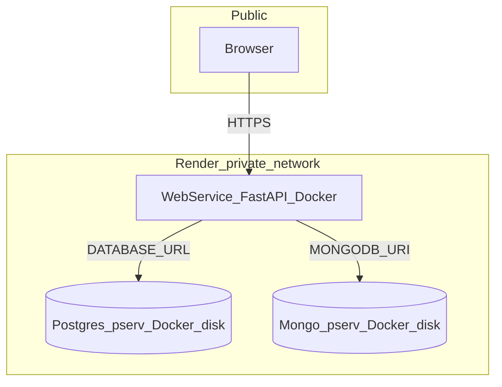

# Mark 2 — Render, Docker Postgres + Docker Mongo, chat history

## Product goal

Persist NoteWise beyond the browser: **PostgreSQL** for relational data, **MongoDB** for **chat history**, backend on **Render** as a **Docker Web Service**, both databases as **separate Private Services** (official Docker images + **persistent disks**). **Not for clinical use**; no PHI in logs.

## Render topology (non-negotiable)

- **Never** bundle Postgres or Mongo **inside** the API container.
- **API**: Web Service → [`backend/Dockerfile`](backend/Dockerfile) (`dockerContext` = `backend/`).
- **PostgreSQL**: `type: pserv`, image e.g. `postgres:16`, disk on data dir (e.g. `/var/lib/postgresql/data`), env `POSTGRES_USER` / `POSTGRES_PASSWORD` / `POSTGRES_DB`. **Do not** use Render **Managed PostgreSQL** or `create_postgres` MCP for this mark.
- **MongoDB**: `type: pserv`, official image, disk at `/data/db` per [Deploy MongoDB](https://docs.render.com/docs/deploy-mongodb).

## Commit + push rhythm

After **each** phase: commit **tracked** files only, push (e.g. `dev/testing`).

**Subject pattern** (same spirit as Mark 1 history):

`Mark 2 <type>(<scope>): phase N — <short description>`

Examples:

- `Mark 2 chore(cleanup): phase 1 — Mark 2 scaffolding and Cursor rules`
- `Mark 2 feat(render): phase 2 — Render Blueprint and Docker DB topology`
- `Mark 2 feat(db): phase 3 — PostgreSQL integration`
- `Mark 2 feat(chat): phase 4 — MongoDB chat history API`
- `Mark 2 feat(frontend): phase 5 — persist chats via backend`
- `Mark 2 chore(deploy): phase 6 — Render env wiring and smoke checklist`

## Cursor “use everything” playbook (global)

Use these **in every phase** as appropriate:

| Trick | How to use it |
|--------|----------------|
| **Plan mode** | Lock requirements before large edits; iterate the plan (this file) before coding. |
| **Composer / Agent** | Multi-file refactors (backend + frontend) with full repo context. |
| **@ mentions** | `@Files` for `main.py`, `Dockerfile`; `@Folder` for `backend/app`, `frontend/src`; `@Codebase` for “where is chat state”. |
| **Parallel tool use** | Batch reads/greps; run **2+ Task subagents** in one turn when tasks are independent (see per-phase agent counts). |
| **Task subagents** | `explore` for repo/doc mapping; `shell` for git/conda/docker; `deployment-expert` for Render; `readonly` explore for plan-only turns. |
| **Rules** | Tracked [`.cursor/rules/`](.cursor/rules/) after Phase 1 — project facts survive without `CLAUDE.md`. |
| **Terminal** | `conda activate notewise`, `uvicorn`, `alembic`, `pytest`, local Docker compose if you add it later. |
| **Diff / review** | Review staged diff before commit; keep `.claude/` and `CLAUDE.md` unstaged. |
| **MCP in Composer** | Enable **user-render**, **context7**, **mongodb**, **neon**, **cursor-ide-browser** when relevant (see phases). |
| **Browser MCP** | After Phase 5: snapshot UI, network tab for API errors, CORS. |

**Agent count convention in this doc**: “**N specialized agents**” = recommended **parallel Cursor Task (`subagent_type`) invocations** for that phase (not counting the lead Composer session). Adjust down if you prefer a single thread.

---

## Phase 1 — Delete `CLAUDE.md`, clean `.claude/`, Mark 2 skills, tracked rules

**Deliverables**

- Delete root [`CLAUDE.md`](CLAUDE.md).
- Remove Mark 1 tree under [`.claude/`](.claude/); add **local only** `.claude/skills/mark-2/SKILL.md` (orchestrator: phase detection via `git log` for `Mark 2`, commit, push) and `.claude/skills/mark-2-phase-1` … `mark-2-phase-6`.
- Add tracked [`.cursor/rules/notewise.mdc`](.cursor/rules/notewise.mdc) (or similar): ports, branch, conda reminder, “NOT for clinical use”, never commit secrets, `.claude/` + `CLAUDE.md` never staged.

**Commit + push**: tracked files only.

| Resource | Spec |
|----------|------|
| **Specialized agents** | **2** — (1) `explore` readonly: map `.claude/` + any `CLAUDE.md` references in repo; (2) `generalPurpose` or main Composer: apply deletes + write `.cursor/rules` + skill stubs. |
| **Skills** | Cursor user skill **create-rule** (authoring `.cursor/rules`); **git-advanced** (pre-commit / never-stage paths); local (gitignored) **mark-2-phase-1** under `NoteWise/.claude/skills/`. |
| **MCPs** | None required. |
| **Plugins** | Cursor **Rules** + optional **GitLens** (blame/history) for commit-style reference. |

---

## Phase 2 — `render.yaml` + `.env.example`

**Deliverables**

- Root [`render.yaml`](render.yaml): Web (Docker) + **Postgres pserv+disk** + **Mongo pserv+disk**; internal service names for `DATABASE_URL` / `MONGODB_URI` placeholders in docs/comments.
- Update [`.env.example`](.env.example): `DATABASE_URL`, `MONGODB_URI`, `CORS_ORIGINS`, keep existing API keys.

**Commit + push**: `render.yaml`, `.env.example`.

| Resource | Spec |
|----------|------|
| **Specialized agents** | **3** — (1) `explore` + **plugin-context7** / docs: Render Blueprint `pserv` + disk fields; (2) `explore` readonly: verify [`backend/Dockerfile`](backend/Dockerfile) paths vs `dockerContext`; (3) `deployment-expert` or main session: assemble YAML + env template. |
| **Skills** | **docker-kubernetes** (Dockerfile/context); **cloud-gcp** only if contrasting prior Cloud Run docs; local **mark-2-phase-2**. |
| **MCPs** | **plugin-context7-plugin-context7** — Render Blueprint / Private Service / disks. **user-render** — `list_services`, `get_service`, `list_deploys`, `list_logs` (inspection); **do not** use `create_postgres` (managed DB). |
| **Plugins** | Render dashboard for first-time Blueprint sync if MCP cannot create Docker web service fully. |

---

## Phase 3 — PostgreSQL in FastAPI

**Deliverables**

- `asyncpg` + SQLAlchemy 2 async, lifespan-managed engine/session, Alembic under `backend/`, minimal table + migration, safe `/health` or `/health/db` (no connection string logging).

**Commit + push**: backend only (+ migration).

| Resource | Spec |
|----------|------|
| **Specialized agents** | **2** — (1) `explore`: existing `main.py` / router layout; (2) `generalPurpose`: implement `app/db`, Alembic, wire lifespan. |
| **Skills** | **backend-engineering**; **database-engineering**; **clean-code**; local **mark-2-phase-3**. |
| **MCPs** | **plugin-context7** — FastAPI lifespan, SQLAlchemy 2 async. **plugin-neon-postgres-neon** — SQL/async URL troubleshooting (driver-agnostic tips). |
| **Plugins** | None required. |

---

## Phase 4 — MongoDB chat history API

**Deliverables**

- Motor, router e.g. `app/routers/chat_history.py`: list/create conversation, get thread, append messages; schema as embedded messages or separate collection (decide once, comment in code); **no** message body in logs.

**Commit + push**: backend router + deps.

| Resource | Spec |
|----------|------|
| **Specialized agents** | **2** — (1) `explore`: RAG/transcribe patterns for consistency; (2) `generalPurpose`: Motor + routes + models. |
| **Skills** | **api-design**; **appsec-owasp** (limits / abuse); **llm-app-development** (logging hygiene); local **mark-2-phase-4**. |
| **MCPs** | **plugin-mongodb-mongodb** — schema design + index suggestions (`mongodb-schema-design`, `mongodb-natural-language-querying` descriptors). |
| **Plugins** | None required. |

---

## Phase 5 — Frontend: hydrate + persist chats

**Deliverables**

- [`frontend/src/lib/api.ts`](frontend/src/lib/api.ts) (or sibling) for chat endpoints; [`frontend/src/pages/Index.tsx`](frontend/src/pages/Index.tsx) load on mount, save after sends; keep transcribe/SOAP; persist text + roles + timestamps (blob URLs for files optional / metadata-only).

**Commit + push**: frontend + env example for `VITE_*`.

| Resource | Spec |
|----------|------|
| **Specialized agents** | **3** — (1) `explore`: `chat-store` types + `Index.tsx` flow; (2) `generalPurpose`: API client + state integration; (3) **cursor-ide-browser** (or agent with browser): smoke the flow against local API. |
| **Skills** | **frontend-developer**; **ultimate-ui**; **accessibility-wcag** if UI changes; local **mark-2-phase-5**. |
| **MCPs** | **plugin-context7** — Vite env. **cursor-ide-browser** — snapshot, network, console after changes. |
| **Plugins** | React/TS LSP; optional **ESLint** fix-on-save. |

---

## Phase 6 — Deploy verification

**Deliverables**

- Render dashboard: env vars, `CORS_ORIGINS` for production frontend origin, internal Mongo/Postgres URLs; smoke `/health`, DB health, chat CRUD.

**Commit + push**: only if code fixes (CORS, Dockerfile `PORT`, etc.).

| Resource | Spec |
|----------|------|
| **Specialized agents** | **2** — (1) `deployment-expert`: Render env + rollout notes; (2) `shell` or browser agent: curl/smoke or MCP browser against deployed URL if public. |
| **Skills** | **docker-kubernetes**; **observability**; local **mark-2-phase-6**. |
| **MCPs** | **user-render** — `list_deploys`, `list_logs`, `get_metrics`. **cursor-ide-browser** — production UI if reachable. |
| **Plugins** | Render dashboard (source of truth for Docker + pserv). |

**Billing / fallback**: Two `pserv` + disks may need a paid Render tier. App code remains valid with any reachable Postgres + Mongo URLs if you host DBs elsewhere; Mark 2 **target** remains Docker Postgres + Docker Mongo on Render.

---

## Orchestrator (local skill)

**`.claude/skills/mark-2/SKILL.md`**: Parse `git log` for `Mark 2` + `phase`; run matching **mark-2-phase-N** skill; verify; `git add` **tracked** only; commit; `git push`.

## Pre-commit

Never stage `.claude/` or `CLAUDE.md`. Keep or add a guard matching `^\.claude/` and `^CLAUDE\.md$`.

## Codebase anchors

- Backend entry: [backend/app/main.py](../../backend/app/main.py)
- Chat UI state: [frontend/src/pages/Index.tsx](../../frontend/src/pages/Index.tsx), [frontend/src/lib/chat-store.ts](../../frontend/src/lib/chat-store.ts)
- Docker: [backend/Dockerfile](../../backend/Dockerfile)
