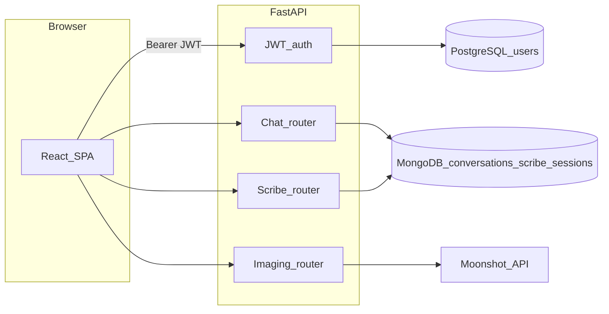

# Mark 3 — Auth (Postgres), scoped Mongo history, Moonshot imaging

## Product and safety

- NoteWise remains a **demo**; **NOT for clinical use**. Keep disclaimers on imaging and any new user-visible API copy ([`backend/app/main.py`](backend/app/main.py) description, imaging responses).
- **Never** commit API keys (including `MOONSHOT_API_KEY`), JWT secrets, or PHI. Extend [`.env.example`](.env.example) with placeholder keys only.
- **No PHI in logs** — continue avoiding transcript/message bodies in logs (same discipline as [`backend/app/routers/chat.py`](backend/app/routers/chat.py)).

## Commit + push rhythm (matches repo history)

After **each** phase: commit **tracked** files only, push to your working branch (e.g. `dev/testing`).

**Subject pattern** (same as Mark 1 / Mark 2):

`Mark 3 <type>(<scope>): phase N — <short description>`

**Examples** (adjust scopes if you prefer):

- `Mark 3 chore(scaffold): phase 1 — Mark 3 skills and Cursor rules`
- `Mark 3 feat(auth): phase 2 — PostgreSQL users and JWT API`
- `Mark 3 feat(mongo): phase 3 — user-scoped chat and scribe history`
- `Mark 3 feat(imaging): phase 4 — Moonshot vision API replaces ViT`
- `Mark 3 feat(frontend): phase 5 — login and authenticated API client`
- `Mark 3 chore(deploy): phase 6 — env template, slim Docker, smoke checklist`

Reference commits: `Mark 2 feat(db): phase 3 — PostgreSQL integration`, `Mark 2 feat(chat): phase 4 — MongoDB chat history API`, `Mark 1 feat(imaging): phase 4 — MONAI ViT imaging endpoint`.

## Interpretation: “chat history” vs “conversation history”

Today, sidebar threads live in Mongo collection **`conversations`** with embedded **`messages`** ([`backend/app/routers/chat.py`](backend/app/routers/chat.py)). SOAP notes are **only in React state** ([`frontend/src/pages/Index.tsx`](frontend/src/pages/Index.tsx)) and are lost on refresh.

| Store | Role |
|--------|------|
| **Chat history** | User-scoped **`conversations`** documents (thread metadata + embedded messages), same API shape as today but filtered by authenticated `user_id`. |
| **Conversation / scribe history** | New collection (e.g. **`scribe_sessions`**) per user: transcript text, optional SOAP JSON, timestamps, optional `linkedConversationId` — **persisted** visit artifacts separate from free-form chat. |

If you later prefer normalized messages (separate `messages` collection), treat that as a follow-up migration; Mark 3 can stay embedded for lower churn.

## Architecture (high level)

## Moonshot (replaces ViT)

- **Implementation**: Use the existing **`openai`** SDK with `base_url` set to Moonshot’s OpenAI-compatible endpoint (e.g. `https://api.moonshot.ai/v1` or `https://api.moonshot.cn/v1` per your account) and `api_key` from **`MOONSHOT_API_KEY`** ([Moonshot migration / vision docs](https://platform.moonshot.ai/docs/guide/migrating-from-openai-to-kimi), [vision guide](https://platform.moonshot.ai/docs/guide/use-kimi-vision-model)).
- **Request**: `POST /imaging/classify` unchanged for the client — read upload bytes, build `data:image/...;base64,...`, send multimodal `chat.completions` with a strict prompt asking for a **short** structured answer (e.g. JSON: `label`, `confidence` 0–1 if the model can estimate, else omit and map to a default in code).
- **Response**: Keep [`ImagingResponse`](backend/app/routers/imaging.py) fields (`label`, `confidence`, `model_id`, `disclaimer`) so [`frontend/src/lib/api.ts`](frontend/src/lib/api.ts) `classifyImage` stays stable; set `model_id` to the configured Moonshot model name (env e.g. **`MOONSHOT_VISION_MODEL`**).
- **Remove local model stack**: Drop **`torch`**, **`torchvision`**, **`timm`** from [`backend/requirements.txt`](backend/requirements.txt) and delete or replace [`backend/app/imaging/classifier.py`](backend/app/imaging/classifier.py). This **shrinks** the Docker image ([`backend/Dockerfile`](backend/Dockerfile)) materially.
- **Skills / MCP for this phase**: **llm-app-development**, **prompt-engineering**; **plugin-context7-plugin-context7** for OpenAI Python SDK + Moonshot base URL patterns.

## Phase-by-phase deliverables

### Phase 1 — Scaffold (skills + rules)

**Deliverables**

- Gitignored [`.claude/skills/mark-3/SKILL.md`](.claude/skills/mark-3/SKILL.md) orchestrator (detect `Mark 3` + phase from `git log`; run `mark-3-phase-N`).
- Gitignored `mark-3-phase-1` … `mark-3-phase-6` stubs mirroring Mark 2’s pattern.
- Small update to tracked [`.cursor/rules/notewise.mdc`](.cursor/rules/notewise.mdc): Mark 3 env vars (`JWT_SECRET`, `MOONSHOT_*`), reminder that auth endpoints exist.

**Commit**: `Mark 3 chore(scaffold): phase 1 — ...`

| Resource | Use when |
|----------|-----------|
| **Skills** | **create-rule**; **git-advanced** (never stage `.claude/`, `.env`); local **mark-3-phase-1** |
| **MCPs** | None required |
| **Agents** | 1× `explore` (readonly) to grep for `CLAUDE.md` / skill references |

---

### Phase 2 — PostgreSQL user auth (API-only, no ORM “physical” beyond tables)

**Deliverables**

- **Tables** (SQLAlchemy models + Alembic migration under [`backend/alembic/versions/`](backend/alembic/versions/)): e.g. **`users`** (`id` UUID, `email` unique, `password_hash`, `created_at`, `is_active`).
- **API**: `POST /auth/register`, `POST /auth/login` → returns **JWT** (`sub` = user id, `exp`, optional `email`); `GET /auth/me` (Bearer required).
- **Security**: bcrypt (or argon2) via **passlib** or **pwdlib**; **python-jose** or **PyJWT** for signing; **`JWT_SECRET`** + **`JWT_ALGORITHM`** + **`ACCESS_TOKEN_EXPIRE_MINUTES`** in settings ([`backend/app/settings.py`](backend/app/settings.py)).
- **Dependency**: `get_current_user` for protected routes in Phase 3+.
- Optional: minimal rate-limit note in code comments (full rate limiting can be deferred).

**Commit**: `Mark 3 feat(auth): phase 2 — ...`

| Resource | Use when |
|----------|-----------|
| **Skills** | **backend-engineering**, **database-engineering**, **api-design**, **appsec-owasp**, **cryptography**; local **mark-3-phase-2** |
| **MCPs** | **plugin-context7-plugin-context7** (FastAPI `Depends`, OAuth2 password flow); **plugin-neon-postgres-neon** (async URL / driver tips) |
| **Agents** | 2× parallel: `explore` (session/router layout), main Composer for implementation |

**Anchors**: [`backend/app/db/models.py`](backend/app/db/models.py), [`backend/app/db/session.py`](backend/app/db/session.py), [`backend/app/main.py`](backend/app/main.py).

---

### Phase 3 — MongoDB: user-scoped chat + scribe / conversation history

**Deliverables**

- **Chat (`conversations`)**: Add **`userId`** (string, UUID from JWT) on create; **all** list/get/append/delete queries **`$match` on `userId`** so users cannot read others’ threads. Migration: existing docs without `userId` — either one-time script or treat as orphaned (document in code comment).
- **Indexes**: `{ userId: 1, updatedAt: -1 }` on `conversations`; same on `scribe_sessions` as needed.
- **New router** e.g. `app/routers/scribe_history.py` with prefix `/scribe` (name flexible): CRUD or at least **create + list + get** for **`scribe_sessions`** (fields: `userId`, `transcript`, `soap` object optional, `createdAt`, `updatedAt`, optional `linkedConversationId`).
- Register router in [`backend/app/main.py`](backend/app/main.py). Protect with **`get_current_user`**.
- Update existing [`backend/app/routers/chat.py`](backend/app/routers/chat.py) to require auth and set/filter **`userId`**.

**Commit**: `Mark 3 feat(mongo): phase 3 — ...`

| Resource | Use when |
|----------|-----------|
| **Skills** | **api-design**, **appsec-owasp**, **llm-app-development** (logging hygiene); local **mark-3-phase-3** |
| **MCPs** | **plugin-mongodb-mongodb** (compound indexes, schema patterns) |
| **Agents** | 2×: `explore` (chat router), `generalPurpose` (Motor + indexes) |

---

### Phase 4 — Imaging: Moonshot API instead of ViT

**Deliverables**

- New module e.g. `app/imaging/moonshot_classify.py`: async `httpx` or **AsyncOpenAI** call with image `data:` URL + prompt; parse model output into **`label` / `confidence` / `model_id` / `disclaimer`**.
- [`backend/app/routers/imaging.py`](backend/app/routers/imaging.py): call async classifier; on missing API key return **503** with clear message (no key leakage).
- Remove **torch / torchvision / timm** from requirements; adjust Dockerfile if any implicit deps disappear.
- `.env.example`: **`MOONSHOT_API_KEY`**, **`MOONSHOT_BASE_URL`**, **`MOONSHOT_VISION_MODEL`**.

**Commit**: `Mark 3 feat(imaging): phase 4 — ...`

| Resource | Use when |
|----------|-----------|
| **Skills** | **llm-app-development**, **prompt-engineering**; local **mark-3-phase-4** |
| **MCPs** | **plugin-context7-plugin-context7** (OpenAI Python async client, multimodal message shape) |

---

### Phase 5 — Frontend: auth + Bearer on API calls

**Deliverables**

- **Token storage**: e.g. `localStorage` key for access token (document XSS tradeoff in a code comment); central helper in [`frontend/src/lib/api.ts`](frontend/src/lib/api.ts) to attach **`Authorization: Bearer ...`** on `fetch` for `/chat`, `/scribe`, and optionally global.
- **UI**: minimal **login / register** flow (new page or modal) consistent with existing design (**ultimate-ui**, **frontend-developer**); on success, hydrate chats as today.
- **Scribe persistence**: after SOAP generation in [`Index.tsx`](frontend/src/pages/Index.tsx), **POST** to `/scribe/sessions` (or chosen path); on load, optionally fetch list for a future “History” UI (can be stubbed if timeboxed).
- **`VITE_*`**: no secrets; only `VITE_API_BASE` as today.

**Commit**: `Mark 3 feat(frontend): phase 5 — ...`

| Resource | Use when |
|----------|-----------|
| **Skills** | **frontend-developer**, **ultimate-ui**, **accessibility-wcag** (forms, focus); local **mark-3-phase-5** |
| **MCPs** | **cursor-ide-browser** — snapshot, network tab for 401/CORS after auth |

---

### Phase 6 — Deploy / ops checklist

**Deliverables**

- Update [`.env.example`](.env.example) and [`render.yaml`](render.yaml) comments (if present) with **`JWT_SECRET`**, **`MOONSHOT_*`** for Render dashboard.
- Smoke order: register → login → `GET /auth/me` → chat CRUD → scribe create → `POST /imaging/classify` with key set → image size / timeout note for serverless.
- **Docker**: confirm slimmer image still builds (`conda activate notewise`, `docker build`).

**Commit**: only if code/docs in repo change — `Mark 3 chore(deploy): phase 6 — ...`

| Resource | Use when |
|----------|-----------|
| **Skills** | **docker-kubernetes**, **observability**; local **mark-3-phase-6** |
| **MCPs** | **user-render** — deploys/logs if you use Render |

---

## Cursor “use the right skill” playbook (every phase)

| Phase | Primary skills | MCPs / plugins |
|-------|----------------|----------------|
| 1 | create-rule, git-advanced | GitLens optional |
| 2 | backend-engineering, cryptography, api-design | context7, neon |
| 3 | api-design, appsec-owasp | mongodb |
| 4 | llm-app-development, prompt-engineering | context7 |
| 5 | frontend-developer, ultimate-ui | cursor-ide-browser |
| 6 | docker-kubernetes, deployment-expert | user-render |

Use **Plan mode** before large edits; **Composer** for cross-cutting changes; **parallel Task agents** where independent (explore + implementation).

## Pre-commit / git hygiene

- Do not stage `.claude/`, `CLAUDE.md`, or `.env`.
- Keep orchestrator skills **gitignored** like Mark 2.

## Optional follow-ups (out of scope unless you expand Mark 3)

- Refresh tokens / httpOnly cookies
- pytest for auth + chat authorization
- Normalized `messages` collection for very large threads
